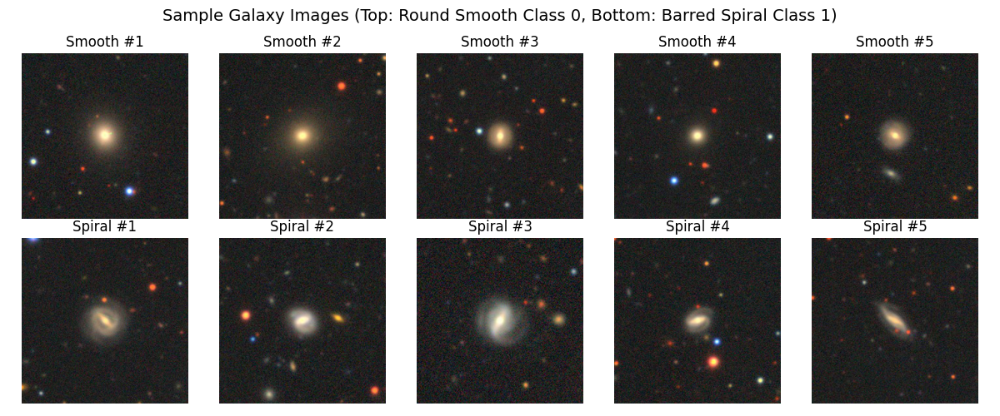
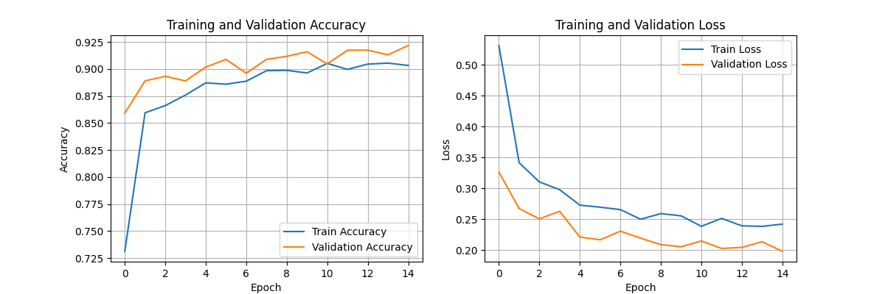
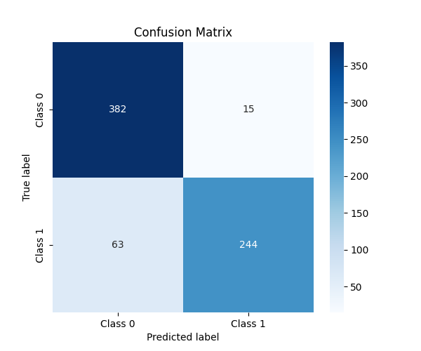
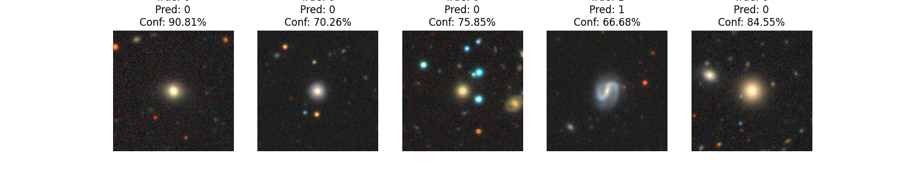
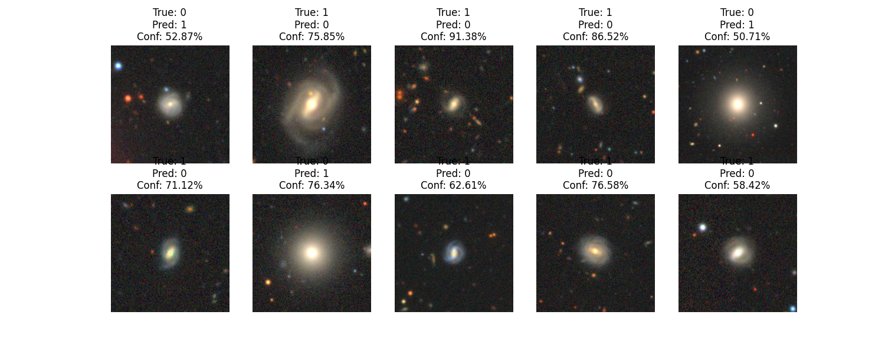

# 🌌 Galaxy Morphology Classification using Deep Learning

> A comparative deep learning approach for automated galaxy morphology classification using a **Custom Convolutional Neural Network (CNN)** and **MobileNetV2 Transfer Learning** on the Galaxy Zoo dataset.


---

# 📖 Overview

Modern astronomical surveys capture millions of galaxy images, making manual classification impractical. This project develops and compares two deep learning approaches to automatically classify galaxies based on their morphology.

The project implements:

- A **Custom CNN** developed from scratch.
- **MobileNetV2 Transfer Learning** using pretrained ImageNet weights.

Both models are trained, evaluated, and compared to understand the benefits of transfer learning for astronomical image classification.

---

# 🎯 Problem Statement

Galaxy morphology provides important insights into galaxy formation and evolution. However, manually classifying thousands or millions of galaxies is time-consuming and prone to inconsistencies.

The objective of this project is to build an automated deep learning system capable of classifying galaxies into:

- **Round Smooth Galaxies**
- **Barred Spiral Galaxies**

and compare the performance of a custom-built CNN against a modern transfer learning approach.

---

# 📂 Dataset

**Dataset:** Galaxy Zoo

Galaxy Zoo is a citizen science project where volunteers classify galaxies based on their visual morphology.

### Dataset Information

- Dataset: Galaxy Zoo
- Image Format: RGB Images
- Image Size: 256 × 256 × 3
- Storage Format: HDF5 (.h5)

### Classes

| Label | Galaxy Type |
|-------|-------------|
| 0 | Round Smooth Galaxy |
| 1 | Barred Spiral Galaxy |

**Dataset Source**

- Galaxy Zoo
- https://www.galaxyzoo.org/

> The dataset is not included in this repository due to its size. Download it from the official source and place it in the project directory before running the notebook.

---

# 🏗 Project Architecture

The project consists of two deep learning models.

## Model 1 — Custom CNN

Architecture:

```
Input Image
      │
Conv2D (32)
      │
MaxPooling
      │
Conv2D (64)
      │
MaxPooling
      │
GlobalAveragePooling
      │
Dense (128)
      │
Dropout (0.5)
      │
Sigmoid Output
```

---

## Model 2 — MobileNetV2 Transfer Learning

Architecture:

```
Input Image
      │
MobileNetV2
(ImageNet Pretrained)
      │
GlobalAveragePooling
      │
Dropout
      │
Dense (Sigmoid)
```

*(Architecture diagrams can be found in the `images/` folder.)*

---

# 🛠 Tech Stack

- Python
- TensorFlow
- Keras
- NumPy
- Matplotlib
- Seaborn
- scikit-learn
- h5py
- Jupyter Notebook

---

# ⚙ Solution Approach

The project follows a complete deep learning pipeline.

## 1. Data Loading

- Load Galaxy Zoo dataset
- Read HDF5 images and labels

---

## 2. Exploratory Data Analysis

- Dataset inspection
- Class distribution
- Sample galaxy visualization

---

## 3. Data Preprocessing

- Convert images to NumPy arrays
- Normalize pixel values
- Resize images (where required)
- Train/Test split

---

## 4. Model Development

### Baseline Model

A custom CNN was designed from scratch to establish a baseline performance.

### Improved Model

MobileNetV2 transfer learning was implemented to improve feature extraction and classification performance.

---

## 5. Model Training

Training includes:

- Binary Cross Entropy Loss
- Adam Optimizer
- Validation Split
- Early Stopping
- Learning Rate Scheduling

---

## 6. Model Evaluation

The models are evaluated using:

- Accuracy
- Precision
- Recall
- F1 Score
- Confusion Matrix
- Classification Report

---

## 7. Error Analysis

The notebook includes:

- Correct predictions
- Misclassified galaxies
- Prediction confidence
- Discussion of challenging cases

---

# 📊 Results

The project compares two different approaches:

| Model | Description |
|--------|-------------|
| Custom CNN | Baseline model developed from scratch |
| MobileNetV2 | Transfer learning model using pretrained ImageNet weights |

Evaluation includes:

- Test Accuracy
- Precision
- Recall
- F1 Score
- Confusion Matrix
- Training Curves
- Error Analysis

---

# 🖼 Visual Results

## Sample Galaxies



---

## Training Curves



---

## Confusion Matrix



---

## Correct Predictions



---

## Misclassified Predictions



---

# 📁 Project Structure

```
Galaxy-Classification-Deep-Learning/

│── README.md
│── LICENSE
│── requirements.txt
│── .gitignore
│── Galaxy Classification using CNN.ipynb
│── galaxy_classifier.keras

├── images/
│   ├── sample_galaxies.png
│   ├── training_curves.png
│   ├── confusion_matrix.png
│   ├── correct_predictions.png
│   └── misclassified_predictions.png
```

---

# 🚀 Installation

Clone the repository

```bash
git clone https://github.com/YOUR_USERNAME/Galaxy-Classification-Deep-Learning.git

cd Galaxy-Classification-Deep-Learning
```

Install dependencies

```bash
pip install -r requirements.txt
```

Launch Jupyter Notebook

```bash
jupyter notebook
```

Open:

```
Galaxy Classification using CNN.ipynb
```

---

# 🔮 Future Improvements

- Fine-tune MobileNetV2 layers
- Experiment with EfficientNet and ResNet
- Multi-class galaxy morphology classification
- Grad-CAM explainability
- Streamlit web application
- FastAPI deployment

---

# 📚 References

- Galaxy Zoo Project
- TensorFlow Documentation
- Keras Documentation
- MobileNetV2 Research Paper

---

# 👨‍💻 Author

**Prakhar Neve**

B.Tech – Computer Science & Business Systems

**Areas of Interest**

- Artificial Intelligence
- Machine Learning
- Computer Vision
- Computational Astrophysics
- Scientific AI

---

# 📜 License

This project is licensed under the MIT License.
